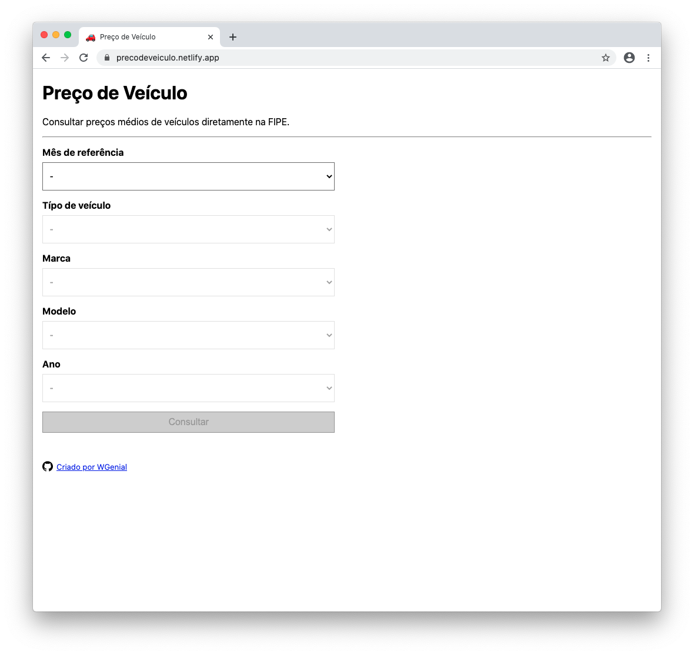
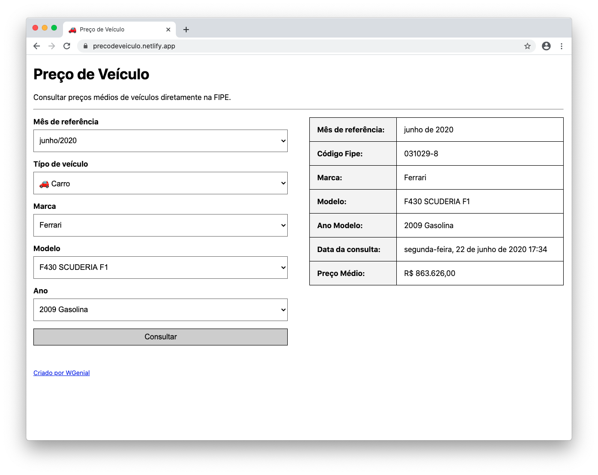

# Preço de Veículo

[](https://www.paypal.com/cgi-bin/webscr?cmd=_donations&business=9H3JB6XAGJU72&currency_code=BRL&source=url)
[](https://twitter.com/intent/tweet?url=https://github.com/giovanigenerali/precodeveiculo&text=%F0%9F%9A%97%20Consultar%20pre%C3%A7os%20m%C3%A9dios%20de%20ve%C3%ADculos%20diretamente%20na%20FIPE.)
[](https://github.com/giovanigenerali/precodeveiculo/blob/master/LICENSE)

## Demo

[https://precodeveiculo.netlify.app](https://precodeveiculo.netlify.app)

[](https://app.netlify.com/start/deploy?repository=https://github.com/giovanigenerali/precodeveiculo)

[https://precodeveiculo.vercel.app](https://precodeveiculo.vercel.app)

[](https://vercel.com/import/git?s=https%3A%2F%2Fgithub.com%2Fgiovanigenerali%2Fprecodeveiculo)





## Docker

Para rodar a aplicação basta executar no terminal

```
docker-compose up -d
```

Pronto, agora acesse http://localhost:3000

Mais informações sobre `docker-compose` acesse
https://docs.docker.com/compose/reference

## Autor

- [@giovanigenerali](https://github.com/giovanigenerali)
